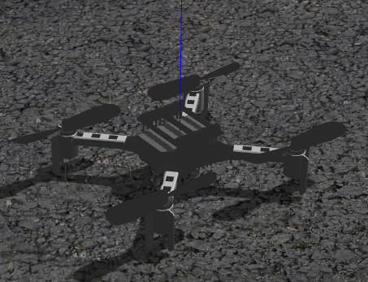

# 基于PX4的无人机定位demo
本项目旨在实现基于PX4飞控`uwb imu`进行`eskf`的多无人机定位项目
***
### 配置
* 本人使用`ubuntu20.04`  
* 如果还没下载编译`PX4`，建议参考如下网站：
* 想要安装PX4仿真环境不要直接git clone这个代码库，按照下面这两个链接一步步配置，出现bug选择百度等搜索引擎解决，我也不记得怎么修理    
https://docs.qq.com/doc/DZlNOVnhaV0hkaktL?dver=  
https://blog.csdn.net/qq_38250687/article/details/123251913
***
***
### 主要文件存放位置
```
PX4-Autopilot/launch 存放launch文件  
PX4-Autopilot/Tools/sitl_gazebo/models 存放models  
PX4-Autopilot/Tools/sitl_gazebo/worlds 存放worlds
/home/(user)/.gazebo/models 这里也存放了一部分models  
```
`launch`文件夹和`models`文件夹中带`_cp`后缀的为本人修改的  
***
***
### 实现无人机定高飞行
* [PDXzst-ros功能包](https://github.com/PDXzst/ros_ws/tree/main/catkin_ws/src)下载功能包offboard_pkg  
* 运行gazebo
```
roslaunch px4 mavros_posix_sitl_cp.launch
```
地图出现一架无人机：  
<div align="center">
  

</div>

* 运行板载控制程序  
```
rosrun offboard_pkg offboard_node
```
* 等待  
起飞成功： 
<div align="center">
  

</div>

**注**:`iris_crazyflie`无人机暂时无法实现定高控制，请等待后续更新`demo`   
***
***
### 更改model
* launch文件中更改`vehicle_model`  
* 目前在使用的无人机：
<div align="center">
  
|无人机|介绍|
|:---:|:---:|
|iris|自带无人机|
|iris_ crazyflie_cp|目前可以的crazyflie无人机（暂不能实现定高飞行）|
|crazyflie|crazyflie无人机（使用iris机身文件，可定高飞行）|

</div>

***
***
### 更改world
* `launch`文件中更改`world`  
***
***
### 多架无人机gazebo仿真
```
roslaunch px4 multi_uav_mavros_sitl_cp.launch
```
运行结果如下：
<div align="center">
  


</div>

### world
更新3个室内地图，1个室外地图  
室内地图`indoor1.world`：  

<div align="center">
  


</div>

室内地图`indoor2.world`:  

<div align="center">
  


</div>

室内地图`indoor3.world`:  

<div align="center">
  


</div>

室外地图`outdoor.world`:  

<div align="center">
  


</div>

室外地图`outdoor1.world`:  

<div align="center">
  


</div>

### model

<div align="center">
  
|model|details|
|:---:|:---:|
|cpr_office|indoor1模型|
|cpr_ office_construction|indoor2模型|
|crossroads|十字路口模型 |

</div>

### 为robot添加groundtruth
添加如下`demo`至`.sdf`文件中  
```cpp
<plugin name="p3d_base_controller" filename="libgazebo_ros_p3d.so">
    <alwaysOn>true</alwaysOn>
    <updateRate>50.0</updateRate>
    <bodyName>base_link</bodyName>
    <topicName>ground_truth/state</topicName>
    <gaussianNoise>0.01</gaussianNoise>
    <frameName>world</frameName>
    <xyzOffsets>0 0 0</xyzOffsets>
    <rpyOffsets>0 0 0</rpyOffsets>
</plugin>
```

<div align="center">
  


</div>


位置如图☝  
使用`rostopic echo /ground_truth/state`获得机器人位姿  
可在`<topicName>ground_truth/state</topicName>`处改变`topic`  

***
***
### 后续
- [X] 多无人机`虚拟uwb`系统
- [ ] 多无人机`eskf`融合定位系统的搭建


  
